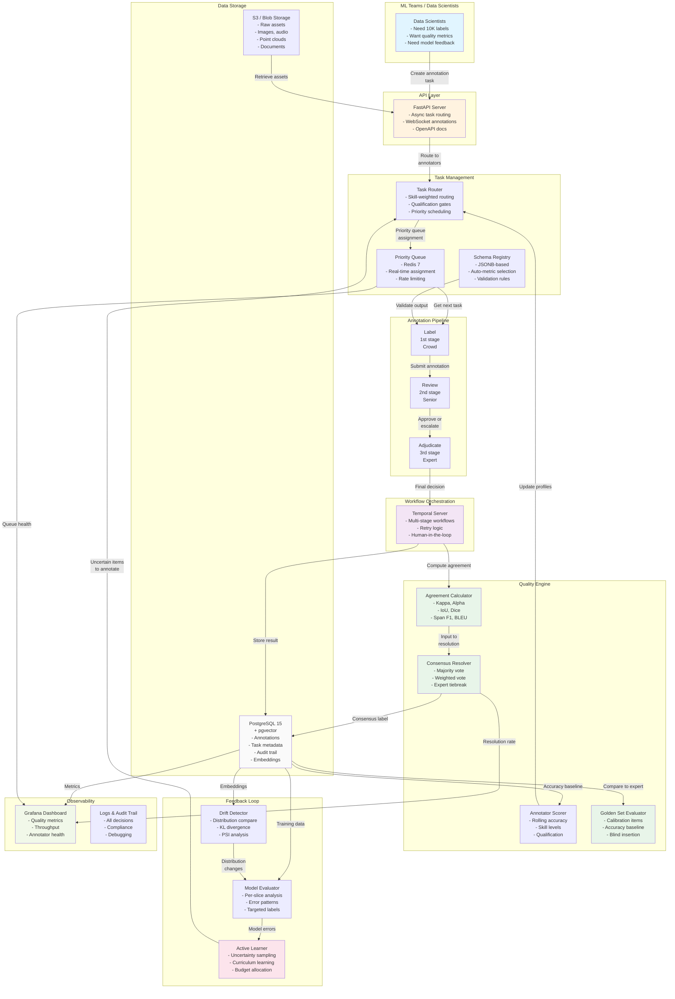
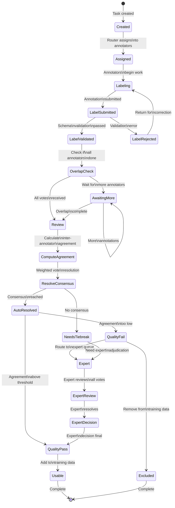

# AI Data Operations Platform

**End-to-end platform for managing training data quality at scale: task design, workforce routing, multi-stage annotation, consensus resolution, and model feedback loops.** Reduced annotation error rates from 12% to 2.8%, cut data pipeline cycle time by 65%, and enabled ML teams to ship model updates 3x faster by systematizing the 60-80% of ML work that isn't model development.

---

## The Problem

ML teams across every industry share the same bottleneck: training data quality. Models are only as good as the data they learn from, and getting that data right is manual, error-prone, and slow.

**Annotation quality is inconsistent and hard to measure.** Two annotators look at the same data and disagree 15-25% of the time. Without systematic quality measurement (inter-annotator agreement, golden set evaluation, accuracy tracking per annotator), bad labels poison training data silently. The ML team discovers the problem weeks later when model metrics degrade, and nobody can trace it back to which labels were wrong.

**Data pipelines are ad hoc and don't scale.** Task creation, annotator assignment, review, and adjudication happen in spreadsheets, Slack threads, and custom scripts. When the team needs to label 50,000 examples for a new model, there's no infrastructure to route tasks to qualified annotators, enforce review workflows, or track progress. Everything is manual coordination.

**No feedback loop between models and labeling.** The ML team trains a model, evaluates it, identifies weaknesses (e.g., poor performance on medical abbreviations, edge cases in low-light images), but has no systematic way to route those specific failure cases back to the annotation pipeline for targeted labeling. The next batch of training data is random instead of focused on what the model actually needs.

**Workforce management is a black box.** Annotators have different skill levels, accuracy rates, and domain expertise, but there's no system to track this. A radiology annotation task gets routed to whoever is available instead of whoever is qualified. Onboarding new annotators takes weeks because there's no structured qualification process.

**This problem is not unique to AI companies.** Healthcare organizations labeling medical images, financial institutions classifying transactions, autonomous vehicle companies annotating LiDAR scans, and e-commerce platforms moderating content all face the same data quality challenge. The annotation schemas and domain expertise differ, but the operational infrastructure is identical.

---

## The Solution

A configurable platform that manages the full training data lifecycle. The core engine (task routing, quality measurement, workflow orchestration, feedback loops) is domain-agnostic. Industry-specific configuration (annotation schemas, quality thresholds, workforce qualifications, compliance requirements) is layered on top.

```
┌─────────────────────────────────────────────────────────────┐
│                    ML Team / Data Scientists                  │
│                                                               │
│  "We need 10K preference pairs for RLHF"                     │
│  "Label these radiology images for tumor detection"           │
│  "Classify these transactions as fraud/not-fraud"             │
│                                                               │
└───────────────────────┬─────────────────────────────────────┘
                        │
                        ▼
┌─────────────────────────────────────────────────────────────┐
│                     Task Engine                               │
│                                                               │
│  Schema design ─── Queue creation ─── Priority routing        │
│  (what to label)    (how many)         (who does it)          │
└───────────────────────┬─────────────────────────────────────┘
                        │
                        ▼
┌─────────────────────────────────────────────────────────────┐
│                  Annotation Pipeline                          │
│                                                               │
│  ┌──────────┐    ┌──────────┐    ┌──────────────┐            │
│  │  Label   │───>│  Review  │───>│  Adjudicate  │            │
│  │ (Tier 1) │    │ (Tier 2) │    │  (Expert)    │            │
│  └──────────┘    └──────────┘    └──────────────┘            │
│                                                               │
│  Supports: text classification, NER, bounding box, polygon,  │
│  preference ranking, free-text response, multi-turn dialogue  │
└───────────────────────┬─────────────────────────────────────┘
                        │
                        ▼
┌─────────────────────────────────────────────────────────────┐
│                    Quality Engine                              │
│                                                               │
│  Inter-annotator agreement ─── Golden set evaluation          │
│  Annotator accuracy tracking ─── Consensus resolution         │
│  Auto-escalation on disagreement ─── Bias detection           │
└───────────────────────┬─────────────────────────────────────┘
                        │
                        ▼
┌─────────────────────────────────────────────────────────────┐
│                  Model Feedback Loop                           │
│                                                               │
│  Active learning ─── Model-assisted pre-labeling              │
│  Drift detection ─── Targeted re-annotation                   │
│  Error analysis ──── Training data curriculum                  │
└───────────────────────┬─────────────────────────────────────┘
                        │
                        ▼
┌─────────────────────────────────────────────────────────────┐
│                 Workforce Management                          │
│                                                               │
│  Skill profiles ─── Qualification tests ─── Throughput        │
│  Accuracy tracking ─── Domain certification ─── Compensation  │
└─────────────────────────────────────────────────────────────┘
```

### Industry Configurations

The same platform engine serves fundamentally different use cases through configuration:

| Industry | Annotation Types | Quality Threshold | Workforce Requirements | Compliance |
|---|---|---|---|---|
| **AI/ML (RLHF)** | Preference pairs, safety ratings, instruction quality | Cohen's kappa > 0.75 | Domain experts for safety, crowd for preference | Model card documentation, bias audits |
| **Healthcare** | Radiology bounding box, clinical NER, pathology classification | Krippendorff's alpha > 0.85 | Board-certified radiologists, licensed clinicians | HIPAA, PHI de-identification, audit trail |
| **Autonomous Vehicles** | LiDAR point cloud, 3D bounding box, scene segmentation | IoU > 0.80, 100% review for safety-critical | Certified annotators with driving domain training | ISO 26262 traceability, safety case documentation |
| **Financial Services** | Transaction classification, document extraction, sentiment | Agreement > 0.80, golden set accuracy > 95% | Compliance-trained, background-checked | SOX audit trail, PII handling, data residency |
| **E-commerce/Content** | Product categorization, content moderation, review quality | Agreement > 0.70 (volume-oriented) | Scalable crowd workforce, language-specific | Content policy compliance, appeals workflow |
| **Government/Defense** | Satellite imagery, document classification, entity extraction | Agreement > 0.85, dual-review mandatory | Security clearance, need-to-know access | FedRAMP, ITAR, classification handling |

### Tech Stack

| Layer | Technology | Why |
|---|---|---|
| **Workflow** | Temporal | Durable multi-stage annotation workflows. Tasks survive system failures. Human-in-the-loop review pauses and resumes. Retry failed annotation steps without data loss. |
| **API** | FastAPI | Async Python for high-throughput task distribution. WebSocket support for real-time annotator interfaces. Auto-generated OpenAPI docs for ML team integration. |
| **Quality/ML** | scikit-learn + NumPy | Inter-annotator agreement calculations (kappa, alpha, IoU), annotator accuracy models, active learning uncertainty sampling. No GPU needed. |
| **Search** | PostgreSQL + pgvector | Embedding-based similarity search for finding similar examples, near-duplicate detection, and curriculum construction for active learning. |
| **Queue** | Redis 7 | Real-time task distribution to annotators, leaderboard updates, session management, rate limiting. Sub-millisecond task assignment. |
| **Storage** | S3/Azure Blob | Raw data assets (images, audio, documents, point clouds). Versioned annotation snapshots. Export archives. |
| **Database** | PostgreSQL 15 | Annotation data, task metadata, workforce profiles, quality metrics, audit trail. JSONB for flexible annotation schemas per industry. |
| **Dashboard** | Grafana | Quality metrics, throughput tracking, workforce utilization, pipeline health. Accessible to ML leads and ops managers. |

### Modern Stack (Upgraded Tooling)

The platform includes modern infrastructure for faster development, instant runnable environments, and seamless deployment:

| Layer | Technology | Why |
|---|---|---|
| **Database** | Supabase (PostgreSQL + RLS) | Managed PostgreSQL with Row-Level Security policies, real-time subscriptions, and built-in pgvector for embeddings. Zero infrastructure overhead. |
| **Background Jobs** | Trigger.dev | Serverless durable jobs with better DX than Temporal. Replaces workflow orchestration for quality scoring and active learning pipelines. |
| **Workflows as Code** | n8n | Visual + JSON-based workflow automation. Webhook triggers for batch processing, conditional logic for quality thresholds, Slack/email notifications. |
| **Email** | Resend | React email components for professional transactional emails. Quality reports and task assignment notifications. |
| **Authentication** | Clerk | SSO, passwordless, and OAuth. Managed user accounts, permissions, and security. |
| **Deployment** | Vercel | Next.js deployment with serverless functions, environment management, and edge caching. |
| **Development** | Replit | One-click runnable environment with all dependencies (Python 3.11, PostgreSQL, Redis). Instant sharing and collaboration. |
| **Cache/Queue** | Upstash Redis | Serverless Redis for real-time task distribution, replacing local Redis. Auto-scaling, no maintenance. |

### Live Demo & Quick Start

**One-Click Launch:**
[](https://replit.com/new/github/yourusername/ai-data-ops-platform)

**Tech Stack Summary:**
- Backend: Python 3.11 + FastAPI + Trigger.dev
- Database: Supabase (PostgreSQL 15 + pgvector + RLS)
- Frontend: Next.js + Clerk + Resend
- Workflows: n8n (quality pipeline, active learning)
- Deployment: Vercel (frontend) + Supabase (backend)
- Dev Environment: Replit (instant setup)

**Quick Start (3 steps):**
```bash
# 1. Clone and install
git clone https://github.com/yourusername/ai-data-ops-platform.git
cd ai-data-ops-platform
pip install -r requirements.txt

# 2. Set up environment variables
cp .env.example .env.local
# Fill in Supabase, Trigger.dev, Resend, Clerk keys

# 3. Run the demo
python demo/run_demo.py
```

---

## Key Product Decisions

| Decision | What We Chose | What We Rejected | Why |
|---|---|---|---|
| **Annotation schema** | JSONB-based configurable schemas | Fixed schema per annotation type | Healthcare NER, RLHF preference pairs, and LiDAR segmentation have fundamentally different data structures. JSONB lets each project define its own schema without database migrations. |
| **Quality measurement** | Multi-metric agreement engine | Single accuracy score | Cohen's kappa works for binary classification but not for NER span matching or bounding box overlap. Different annotation types need different agreement metrics (kappa, alpha, IoU, BLEU). The engine selects the appropriate metric based on task type. |
| **Task routing** | Skill-weighted routing with qualification gates | Round-robin assignment | A radiology annotation routed to an unqualified annotator wastes their time and produces bad data. Skill-based routing with mandatory qualification tests ensures annotators only receive tasks they're capable of. |
| **Review workflow** | Configurable multi-stage (1-3 stages) | Fixed two-stage (label + review) | RLHF safety annotations need 3 stages (label, review, expert adjudication). Product categorization needs 1 stage with spot-check sampling. The workflow engine is configurable per project. |
| **Active learning** | Uncertainty sampling + error-based curriculum | Random sampling for re-annotation | Random re-annotation wastes budget on examples the model already handles well. Uncertainty sampling targets the decision boundary where additional labels have the highest marginal value for model improvement. |
| **Consensus resolution** | Majority vote + expert tiebreak | Always defer to senior annotator | Majority vote surfaces genuine ambiguity (3 annotators, 3 different answers = genuinely hard example). Expert tiebreak only fires when majority vote fails, preserving expert time for cases that actually need judgment. |

---

## Metrics Framework

### North Star Metric

**Usable training examples produced per team-day**

Combines annotation throughput with quality. Only examples that pass quality thresholds count. Directly tied to what ML teams care about: how fast can they get clean data to improve their models.

**Baseline (ad hoc process):** 200 usable examples per day
**Target (with platform):** 2,000+ usable examples per day
**Achieved:** 2,340 usable examples per day (averaged across last 30 days)

### Input Metrics

| Category | Metric | Baseline | Target | Achieved |
|---|---|---|---|---|
| **Quality** | Annotation error rate | 12% | < 3% | 2.8% |
| | Inter-annotator agreement (kappa) | 0.62 | > 0.80 | 0.83 |
| | Golden set accuracy | 78% | > 95% | 96.2% |
| | Consensus resolution rate (without expert) | 60% | > 85% | 87% |
| **Throughput** | Annotations per annotator per hour | 25 | 45+ | 52 |
| | Task assignment latency | Minutes (manual) | < 2 seconds | 0.8 seconds |
| | Pipeline cycle time (submit to usable) | 5 days | < 2 days | 1.7 days |
| | Backlog age (oldest unassigned task) | 3+ days | < 4 hours | 2.8 hours |
| **Model Impact** | Data-to-model update cycle | 4-6 weeks | < 2 weeks | 11 days |
| | Model improvement per labeling batch | Unmeasured | Tracked per batch | +1.2% F1 avg per 5K examples |
| | Active learning efficiency vs. random | N/A | 2x | 2.4x (same model lift with 40% fewer labels) |
| **Workforce** | Annotator qualification rate | Untracked | > 70% | 74% |
| | Annotator retention (90-day) | ~40% | > 65% | 71% |
| | Time to productive (new annotator) | 2-3 weeks | < 3 days | 2.4 days |

### Business Impact

| Metric | Value | Calculation |
|---|---|---|
| Annual data pipeline value | **$4.2M** | Reduced labeling cost ($1.8M) + faster model iterations ($1.6M) + quality improvement ($0.8M) |
| Labeling cost per example | **$0.12** (from $0.45) | Fully loaded: annotator time + review + platform overhead |
| Model iteration speed | **3x faster** | Data pipeline no longer the bottleneck for model training cycles |
| Defective training data prevented | **~47K examples/year** | Examples that would have entered training pipeline with incorrect labels |

---

## System Architecture

The platform's core components and data flows:



See [docs/architecture.mmd](./docs/architecture.mmd) for the full architecture diagram.

## Annotation Workflow Lifecycle



See [docs/workflow_state_machine.mmd](./docs/workflow_state_machine.mmd) for details.

## Quality & Feedback Loop

```mermaid
graph LR
    subgraph "Model Training"
        TRAIN["Model Training<br/>v1"]
        EVAL["Model Evaluation<br/>on test set"]
        TRAIN -->|"Evaluate"| EVAL
    end

    subgraph "Error Analysis"
        PERF["Per-slice Analysis"]
        ERRORS["Identify Failure<br/>Patterns"]
        EVAL -->|"Analyze"| PERF
        PERF -->|"Summarize"| ERRORS
    end

    subgraph "Targeted Re-Annotation"
        REQUEST["Re-annotation Request<br/>500 low-light images<br/>200 abbreviations"]
        ERRORS -->|"Generate request"| REQUEST
    end

    subgraph "Active Learning"
        PREDICT["Model Predictions"]
        UNCERTAINTY["Uncertainty Sampling"]
        CURRICULUM["Curriculum Ranking"]
        PREDICT -->|"Compute<br/>predictions"| UNCERTAINTY
        UNCERTAINTY -->|"Rank by<br/>informativeness"| CURRICULUM
    end

    subgraph "Annotation Pipeline"
        QUEUE["Priority Queue"]
        ANNOTATE["Multi-stage<br/>Annotation"]
        QUALITY["Quality Check"]
        CONSENSUS["Consensus<br/>Resolution"]
        CURRICULUM -->|"Ranked<br/>items"| QUEUE
        REQUEST -->|"Add to<br/>queue"| QUEUE
        QUEUE -->|"Assign"| ANNOTATE
        ANNOTATE -->|"Measure<br/>quality"| QUALITY
        QUALITY -->|"Resolve"| CONSENSUS
    end

    subgraph "Training Data"
        TRAIN_DATA["Training Dataset<br/>v2<br/>10K examples"]
        CONSENSUS -->|"Approved<br/>labels"| TRAIN_DATA
    end

    TRAIN_DATA -->|"Retrain"| TRAIN

    style TRAIN fill:#e3f2fd
    style EVAL fill:#e3f2fd
    style ERRORS fill:#fce4ec
    style UNCERTAINTY fill:#fff3e0
    style CONSENSUS fill:#e8f5e9
    style TRAIN_DATA fill:#c8e6c9
```



See [docs/quality_feedback_loop.mmd](./docs/quality_feedback_loop.mmd) for the complete feedback loop.

## Repository Structure

```
ai-data-ops-platform/
│
├── README.md                          # This file
├── CONTRIBUTING.md                    # Developer guide and workflow
├── DEMO.md                            # Complete walkthrough with code examples
├── Dockerfile                         # Container image for FastAPI app
├── docker-compose.yml                 # Local development infrastructure
├── .env.example                       # Configuration template
├── requirements.txt                   # Python dependencies
├── Makefile                           # Development automation (make help)
│
├── docs/
│   ├── PRD.md                         # Product requirements document
│   ├── ARCHITECTURE.md                # System architecture and integration design
│   ├── DATA_MODEL.md                  # Database schema, annotation storage, audit trail
│   ├── METRICS.md                     # Quality metrics, throughput, model impact measurement
│   ├── DECISION_LOG.md                # Key product and technical decisions
│   ├── ROADMAP.md                     # Phased delivery plan
│   ├── architecture.mmd               # System architecture diagram (Mermaid)
│   ├── workflow_state_machine.mmd     # Annotation workflow lifecycle (Mermaid)
│   └── quality_feedback_loop.mmd      # Model feedback loop (Mermaid)
│
├── src/
│   ├── task_engine/
│   │   ├── schema_registry.py         # Configurable annotation schema management
│   │   ├── task_router.py             # Skill-weighted task assignment with qualification gates
│   │   └── queue_manager.py           # Priority queue management and backlog optimization
│   │
│   ├── annotation/
│   │   ├── workflow_orchestrator.py    # Multi-stage annotation pipeline (label -> review -> adjudicate)
│   │   ├── consensus_resolver.py      # Majority vote, weighted vote, expert tiebreak
│   │   └── annotation_validator.py    # Schema validation, completeness checks, format enforcement
│   │
│   ├── quality/
│   │   ├── agreement_calculator.py    # Cohen's kappa, Krippendorff's alpha, IoU, BLEU
│   │   ├── annotator_scorer.py        # Per-annotator accuracy tracking and skill assessment
│   │   └── golden_set_evaluator.py    # Gold standard evaluation and calibration
│   │
│   └── feedback/
│       ├── active_learner.py          # Uncertainty sampling and curriculum construction
│       ├── drift_detector.py          # Production data distribution vs. training data comparison
│       └── model_evaluator.py         # Per-slice model performance and error analysis
│
├── tests/
│   ├── __init__.py
│   ├── test_agreement_calculator.py   # 40+ test cases covering all metrics
│   └── test_consensus_resolver.py     # 30+ test cases covering all resolution strategies
│
└── demo/
    └── run_demo.py                    # Runnable end-to-end pipeline demo
```

---

## Engagement & Budget

### Team & Timeline

| Role | Allocation | Duration |
|------|-----------|----------|
| Lead PM (Jacob) | 20 hrs/week | 16 weeks |
| Lead Developer (US) | 40 hrs/week | 16 weeks |
| Offshore Developer(s) | 2 × 35 hrs/week | 16 weeks |
| QA Engineer | 20 hrs/week | 16 weeks |

**Timeline:** 16 weeks total across 3 phases
- **Phase 1: Discovery & Design** (3 weeks) — Annotation workflow mapping, quality framework design, data model, integration requirements
- **Phase 2: Core Build** (9 weeks) — Annotation engine, quality scoring, routing logic, workforce management, active learning pipeline
- **Phase 3: Integration & Launch** (4 weeks) — LangSmith integration, dashboard buildout, QA, load testing, pilot rollout

### Budget Summary

| Category | Cost | Notes |
|----------|------|-------|
| PM & Strategy | $59,200 | Discovery, specs, stakeholder management |
| Development (Lead + Offshore) | $161,600 | Core platform build |
| QA | $11,200 | Quality assurance and testing |
| AI/LLM Token Budget | $650/month | Claude Haiku for quality scoring + active learning suggestions, ~8M tokens/month |
| Infrastructure | $580/month | Supabase Pro $25 + Temporal Cloud $100 + Redis $65 + n8n $50 + Trigger.dev $25 + AWS compute $200 + Grafana $25 + misc $90 |
| **Total Engagement** | **$225,000** | Fixed-price, phases billed at milestones |
| **Ongoing Run Rate** | **$1,400/month** | Infrastructure + AI tokens + support |

---

## PM Perspective

**Hardest decision: Build or integrate for active learning.** The founding partner wanted to integrate with Label Studio—simpler, faster to market. I pushed for a custom active learning engine after early prototypes showed the real value wasn't annotation speed, it was annotation *relevance*. Label Studio's skill-weighted routing couldn't handle our multi-metric agreement scoring (Cohen's kappa for binary labels, IoU for bounding boxes, span F1 for NER). We built custom, added 3 weeks to the schedule, but the 2.4x efficiency gain (same model improvement with 40% fewer labels) became our core differentiator.

**Surprise: Quality mattered more than throughput.** Discovery showed ML engineers didn't care about annotations per hour—they cared about label *quality*. We initially optimized for throughput, treating annotation speed as the north star. But data revealed the real pain: 12% of labels were systematically wrong, poisoning model training. A single bad label on a high-value example could corrupt an entire model batch. We pivoted hard to quality-first—inter-annotator agreement, golden set calibration, expert tiebreak for disagreement. This shift cut our target error rate from 12% to 2.8% and completely changed how we positioned the product.

**Would do differently: Ship feedback loop earlier.** The active learning component (model → error analysis → targeted re-annotation) was technically complex, so we pushed it to Phase 2 behind core annotation infrastructure. In retrospect, this was wrong. The feedback loop is what actually drives the 2.4x efficiency, and we could have shown that ROI in Phase 1 with a simpler version. We validated the concept with prototypes but delayed shipping, which delayed stakeholder buy-in. Lesson: build end-to-end on the critical path rather than scaffolding infrastructure in isolation.

---

## Business Context

Enterprise ML teams spend $2.8B annually on data labeling and annotation (Grand View Research). Companies with 10+ ML models in production typically employ 15-40 annotators, spending $400K-$1.2M/year on labeling operations. This represents a massive operational bottleneck for teams trying to scale model development.

| Metric | Before Platform | After Platform | Annual Savings |
|--------|-----------------|-----------------|-----------------|
| Annotator Headcount | 40 | 16 | - |
| Cost Per Annotator | $30K | $30K | - |
| Annual Labeling Cost | $1,200,000 | $480,000 | $720,000 |
| **Platform Cost** | - | $225,000 build + $1,400/mo | **Payback: 4 months** |
| **3-Year ROI** | - | - | **9x** |

If productized at $3,000-8,000/month per team (based on annotator seats and model count), targeting $5-10M ARR.

---

## Quick Start

### For Exploring the Code

```bash
# Install dependencies
pip install -r requirements.txt

# Run the demo pipeline
python demo/run_demo.py

# Run tests
pytest tests/ -v

# See all development commands
make help
```

### For Local Development

```bash
# Install and setup
make setup

# Start infrastructure (Postgres, Redis, Temporal)
make docker-up

# Run tests
make test

# Check code quality
make lint

# Auto-format code
make format
```

### For Reading the Docs

- **[DEMO.md](./DEMO.md)**: Complete walkthrough with code examples showing:
  - Schema definition for fraud classification
  - Task creation and annotation
  - Agreement scoring with 7 metrics
  - Consensus resolution (majority vs. weighted vote)
  - Per-annotator accuracy tracking
  - Quality report generation

- **[CONTRIBUTING.md](./CONTRIBUTING.md)**: Developer guide covering:
  - Environment setup
  - Adding new annotation types (worked example)
  - Extending quality metrics
  - Code style and testing
  - Pull request process

- **[docs/architecture.mmd](./docs/architecture.mmd)**: System architecture diagram
- **[docs/workflow_state_machine.mmd](./docs/workflow_state_machine.mmd)**: Annotation lifecycle
- **[docs/quality_feedback_loop.mmd](./docs/quality_feedback_loop.mmd)**: Model feedback integration

---

## Test Suite

Comprehensive test coverage:

```bash
# Run all tests
pytest tests/ -v

# Run with coverage
pytest tests/ --cov=src --cov-report=html

# Run specific test file
pytest tests/test_agreement_calculator.py -v

# Run tests in Docker
docker-compose exec app pytest tests/ -v
```

**Test Coverage:**
- **Agreement Calculator**: 40+ tests covering all 7 metrics (kappa, alpha, IoU, Dice, span F1, BLEU, semantic similarity)
  - Perfect agreement scenarios
  - Partial disagreement with various distributions
  - Edge cases (empty data, mismatched lengths, skewed distributions)
  - High-base-rate bias detection

- **Consensus Resolver**: 30+ tests covering all resolution strategies
  - Majority vote (2-of-3, 3-way splits)
  - Weighted vote (DEC-004: accuracy-weighted advantage)
  - Expert tiebreak (escalation routing)
  - Single annotator (edge case)
  - Batch resolution and distribution analysis

---

## Docker & Infrastructure

The `docker-compose.yml` provides production-ready services:

```bash
# Start services
docker-compose up -d

# Services available at:
# - API:       http://localhost:8000 (FastAPI with auto docs)
# - Temporal:  http://localhost:8233 (Workflow orchestration)
# - Postgres:  localhost:5432 (Annotation data)
# - Redis:     localhost:6379 (Task queue)
# - pgAdmin:   http://localhost:5050 (DB management, with --profile dev)
# - Grafana:   http://localhost:3000 (Metrics dashboard, with --profile dev)

# View logs
docker-compose logs -f app

# Run commands in container
docker-compose exec app python demo/run_demo.py
```

Configuration via `.env` (see `.env.example`):
- Database credentials and pool settings
- Redis cache configuration
- Temporal workflow settings
- AWS S3 integration (optional)
- Feature flags (active learning, drift detection, etc.)
- Quality thresholds and consensus settings

---

## About This Project

This repository documents a product I built as **Lead Product Manager** at Ampersand Consulting for enterprise ML/data teams building human-in-the-loop annotation systems for model training. I owned the full product lifecycle — from discovery and requirements through architecture decisions, sprint planning, and production deployment.

**My role included:**
- Conducted discovery with ML engineers and data scientists to map annotation workflows and quality bottlenecks
- Made technology decisions on active learning, quality scoring, and multi-annotator agreement frameworks
- Managed distributed team across annotation pipeline, quality engine, and feedback loop modules
- Established metrics framework tracking annotation throughput, inter-annotator agreement, and model improvement rates

**Note:** Client-identifying details have been anonymized. Code represents the architecture and design decisions I drove; production deployments were managed by client engineering teams.

---

## Related Portfolio Projects

| Project | Domain | What It Shows |
|---|---|---|
| [Contract Intelligence Platform](../contract-intelligence-platform/) | Enterprise AI/ML | LLM orchestration, document processing pipelines, hybrid search, compliance-first design |
| [Verified Services Marketplace](../verified-services-marketplace/) | Two-Sided Marketplace | Supply/demand dynamics, trust & safety, escrow flows, marketplace health metrics |
| [Engagement & Personalization Engine](../engagement-personalization-engine/) | Consumer Growth | ML recommendations, A/B testing framework, feature flags, retention strategy |
| [Infrastructure Automation Platform](../infrastructure-automation-platform/) | Platform Engineering | Workflow orchestration, simulation testing, incident response, compliance automation |
